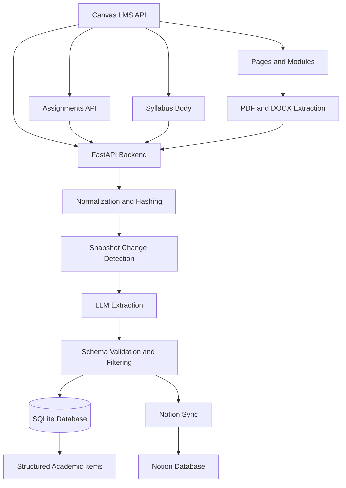

# Canvas Intelligence

FastAPI-based ingestion pipeline that converts unstructured Canvas course data into structured, queryable academic items.

---

## Overview

Canvas Intelligence transforms unstructured and semi-structured Canvas course content into a consistent, machine-readable data model.

The system integrates with the Canvas API, extracts syllabus and assignment data across multiple sources, applies LLM-based structured extraction, and persists results with snapshot-based change tracking.

It is built as a single-user MVP backend with a focus on reliability, deterministic processing, and extensibility.

---

## Architecture



---

## Core Capabilities

### Multi-Source Ingestion

- Canvas syllabus body
- Canvas pages
- Attached files (PDF, DOCX)
- Canvas modules
- Canvas assignments API

### Structured Extraction Pipeline

- LLM-based semantic parsing into typed academic items
- JSON schema validation for output integrity
- Confidence scoring for each extracted item
- Filtering logic to remove non-actionable content

### Data Normalization and Hashing

- Text normalization for deterministic comparisons
- Content hashing for snapshot detection
- Item-level hashing to prevent duplication

### Persistence Layer

- SQLite + SQLAlchemy
- Snapshot-based versioning (`SourceSnapshot`)
- Structured item storage (`Item` table)
- Detail tables for assignments, exams, and readings

### Change Detection

- Content hash comparison to detect updates
- Cached response return for unchanged sources
- Incremental ingestion behavior

### Notion Integration

- Automatic sync of structured items to a Notion database
- Duplicate prevention using `item_hash`
- Schema validation and config checks

---

## Pipeline Flow

1. Fetch data from Canvas (syllabus, pages, modules, assignments)
2. Normalize and clean raw text
3. Generate a content hash and compare it with the latest snapshot
4. If changed:
   - Run LLM extraction
   - Validate output against schema
   - Filter low-quality items
   - Persist snapshot and items
5. Sync results to Notion
6. Return structured response via API

---

## Tech Stack

- Python
- FastAPI
- SQLAlchemy
- SQLite
- OpenAI API
- Canvas LMS API
- Notion API

---

## Project Structure

```text
main.py            # API routes and ingestion pipeline
models.py          # Database schema
utils.py           # normalization and hashing utilities
db.py              # database setup
notion.py          # Notion sync logic
requirements.txt   # dependencies
Dockerfile         # containerization
```

---

## API Endpoints

### `POST /canvas/ingest/{course_id}`

Ingests a Canvas course and returns structured academic items.

**Response includes:**
- extracted items (exams, assignments, lectures, readings)
- snapshot IDs
- change detection flags
- Notion sync results

### `POST /parse`

Runs standalone LLM-based parsing on provided text input.

### `GET /notion/status`

Validates Notion API configuration and database schema.

---

## Example API Response

### `POST /canvas/ingest/{course_id}`

```json
{
  "course_id": "189793",
  "changed": true,
  "snapshot_id": 1,
  "assignment_snapshot_id": 1,
  "items": [
    {
      "title": "Exam 1",
      "item_type": "exam",
      "subtype": "midterm",
      "start_date": "2026-02-23",
      "due_date": null,
      "description": "Covers Modules 1-3.",
      "location": "SHW-011",
      "external_id": "exam_1",
      "confidence": 1.0,
      "item_hash": "a9a6bcf5ecba8b7ae2c2a2e5570ded162000e5d110fdfe214c15cbad4a8547ec"
    },
    {
      "title": "Homework 3",
      "item_type": "assignment",
      "subtype": "homework",
      "start_date": null,
      "due_date": "2026-02-10",
      "description": "Covers Chapter 5 problems.",
      "location": null,
      "external_id": "12345",
      "confidence": 0.98,
      "item_hash": "b71e9c6d9e2d7a1d6d5e9b2f9a7e6d5c4b3a2910e8f7d6c5b4a3928171615141"
    }
  ],
  "sources": {
    "syllabus_changed": true,
    "assignment_feed_changed": true
  },
  "notion_sync": {
    "attempted": true,
    "created": 2,
    "skipped": 0,
    "failed": 0
  }
}
```

---

## Environment Variables

Set the following before running:

- `OPENAI_API_KEY`
- `CANVAS_BASE_URL`
- `CANVAS_ACCESS_TOKEN`
- `NOTION_API_KEY`
- `NOTION_DATABASE_ID`
- `ENABLE_NOTION_SYNC`

---

## Installation

```bash
pip install -r requirements.txt
```

## Running the Server

```bash
uvicorn main:app --reload
```

---

## Design Principles

- Deterministic pipelines over ad hoc parsing
- Strong schema validation for LLM outputs
- Separation of ingestion, extraction, and persistence
- Idempotent processing via hashing
- Explicit handling of unreliable upstream data

---

## Future Improvements

- Multi-user support and authentication
- PostgreSQL migration
- Background job queue
- Vector search over course content
- Frontend dashboard for visualization
